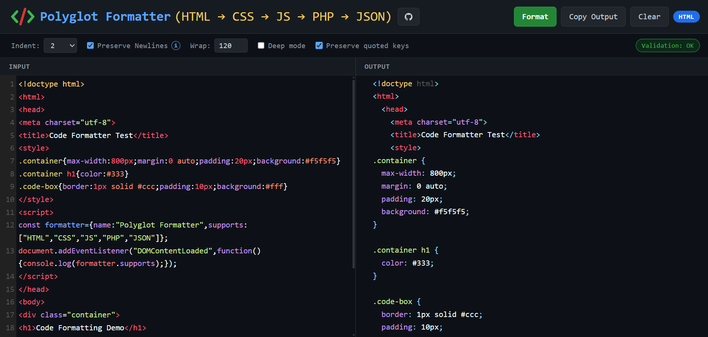

<p align="center">
  
</p>

<h1 align="center">Polyglot Formatter</h1>

<p align="center">
  
  
  
  
  
  <br>
  
  
</p>

<p align="center">
  <b>Multi-Language Code Beautifier</b><br>
  <i>Auto-detects HTML, CSS, JavaScript, PHP & JSON — formats instantly in the browser.</i>
</p>

<p align="center">
  
  
  
  
</p>

---



---

**Live version:** [https://neiki.eu/polyglot-formatter](https://neiki.eu/polyglot-formatter)

---

## 📖 About

**Polyglot Formatter** is a browser-based code beautifier that automatically detects the dominant language of your input and formats it with a single click. It supports **HTML**, **CSS**, **JavaScript**, **PHP** and **JSON** — including nested code blocks like `<style>` and `<script>` inside HTML, or mixed PHP/HTML files.

Everything runs client-side — no server, no build step, no account required.

---

## ✨ Features

- **Auto-detection** — Automatically identifies HTML, CSS, JavaScript, PHP and JSON
- **Deep formatting** — Formats nested `<style>` / `<script>` blocks inside HTML, and structural PHP logic inside mixed files
- **Configurable indent** — Choose between 2 or 4 spaces
- **Line wrapping** — Adjustable wrap length (40–300 characters)
- **Preserve newlines** — Option to keep existing line breaks in string values
- **Deep mode** — Optional aggressive formatting of nested string payloads (with safety warnings)
- **Preserve quoted keys** — Keeps JSON keys quoted as-is
- **Syntax highlighting** — Output is highlighted with Prism.js (Tomorrow Night theme)
- **CodeMirror editor** — Input editor with line numbers, bracket matching and auto-close
- **Copy to clipboard** — One-click copy of the formatted output
- **Responsive layout** — Panels stack vertically on mobile devices
- **Dark theme** — Material Darker color scheme throughout
- **Post-format validation** — Warns about potential issues after formatting

---

## 🌐 Supported Languages

| Language | Detection | Formatting | Highlighting |
| --- | --- | --- | --- |
| **HTML** | `<tag>`, `<!DOCTYPE>` | js-beautify `html` | Prism `markup` |
| **CSS** | Selectors, `@` rules | js-beautify `css` | Prism `css` |
| **JavaScript** | `const`, `let`, `function`… | js-beautify `js` | Prism `javascript` |
| **PHP** | `<?php`, `<?=` | Custom PHP formatter | Prism `php` |
| **JSON** | Valid `{…}` / `[…]` | `JSON.parse` + pretty-print | Prism `json` |

---

## 📦 Installation

No build step is required. Clone the repo and open `index.html` in your browser:

```bash
git clone https://github.com/neikiri/polyglot-formatter.git
cd polyglot-formatter
```

Then open **`index.html`** in any modern browser. That's it.

> All dependencies (CodeMirror, Prism.js, js-beautify) are loaded from CDN — no `npm install` needed.

---

## 🚀 Usage

1. **Paste or type** code into the left **Input** panel.
2. The editor auto-detects the language and switches syntax mode.
3. Adjust options in the toolbar if needed:
   - **Indent** — 2 or 4 spaces
   - **Preserve Newlines** — prevents Deep Mode from adding line breaks inside strings
   - **Wrap** — maximum line length before wrapping
   - **Deep mode** — aggressive formatting of nested strings (use with caution)
   - **Preserve quoted keys** — keeps JSON keys quoted
4. Click **Format**.
5. The formatted result appears in the right **Output** panel with syntax highlighting.
6. Click **Copy Output** to copy the result to your clipboard.

---

## ⚙️ Configuration

Default formatting options are defined in `js/config.js`:

```js
const APP_CONFIG = {
  defaults: {
    indentSize: 2,
    preserveNewlines: true,
    wrapLineLength: 120,
    safeMode: true,
    deepMode: false,
    preserveQuotedKeys: true,
    deepStringValues: false
  }
};
```

All options can be changed at runtime through the UI toolbar.

---

## 📚 CDN Dependencies

| Library | Version | Purpose |
| --- | --- | --- |
| [CodeMirror](https://codemirror.net/) | 5.65.16 | Input code editor |
| [Prism.js](https://prismjs.com/) | 1.29.0 | Output syntax highlighting |
| [js-beautify](https://beautifier.io/) | 1.15.1 | HTML / CSS / JS formatting engine |

---

## 🤝 Contributing

Pull requests are welcome. See [CONTRIBUTING.md](CONTRIBUTING.md) for details.

---

## ⚠️ Issues & Limitations

This project is still a work in progress and I’m fully aware that the formatter currently contains a number of bugs and edge cases.

Building a reliable **multi-language formatter (HTML → CSS → JS → PHP → JSON)** is much more complex than I initially expected. It’s very difficult to handle all possible nested combinations without introducing errors, and honestly — I underestimated how hard this problem really is.

Because of that, I’d really appreciate your help 🙏

If you find any bugs, broken formatting, or unexpected behavior, please report them here:
👉 https://github.com/neikiri/polyglot-formatter/issues

Every report helps improve the project.

---

## 📄 License

This project is licensed under the **MIT License** — see the [LICENSE](LICENSE) file for details.

---

## 👨‍💻 Author

**neikiri**
GitHub: https://github.com/neikiri

---

## 📬 Contact

📧 Email: dev@neiki.eu
